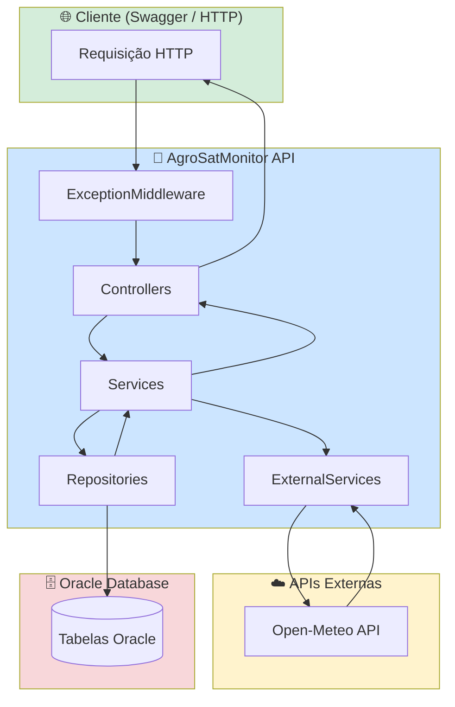
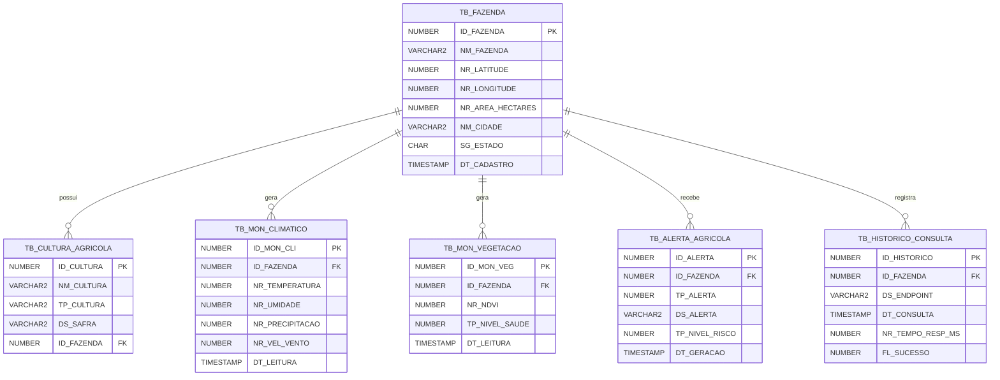

# 🌱 AgroSatMonitor API

> **Sistema de Monitoramento Agrícola com Dados de Satélite e Clima**  
> Projeto Acadêmico — FIAP Pós-Graduação em Inteligência Artificial para Devs

---

## 📋 Índice

1. [Objetivo do Projeto](#-objetivo-do-projeto)
2. [Motivação Acadêmica](#-motivação-acadêmica)
3. [Tecnologias Utilizadas](#-tecnologias-utilizadas)
4. [Estrutura do Projeto](#-estrutura-do-projeto)
5. [Como Configurar o Oracle](#-como-configurar-o-oracle)
6. [Como Executar](#-como-executar)
7. [Como Testar no Swagger](#-como-testar-no-swagger)
8. [Endpoints da API](#-endpoints-da-api)
9. [Exemplos de Requisições](#-exemplos-de-requisições)
10. [Diagrama de Arquitetura](#-diagrama-de-arquitetura)
11. [Fluxograma do Monitoramento](#-fluxograma-do-monitoramento)
12. [Diagrama de Entidades](#-diagrama-de-entidades)
13. [Conceitos de POO Aplicados](#-conceitos-de-poo-aplicados)
14. [Explicação da Arquitetura](#-explicação-da-arquitetura)

---

## 🎯 Objetivo do Projeto

A **AgroSatMonitor API** é um sistema backend de monitoramento agrícola que utiliza coordenadas geográficas de fazendas para:

- Consultar **dados climáticos em tempo real** via API Open-Meteo (temperatura, umidade, precipitação, vento)
- Calcular o **Índice de Vegetação por Diferença Normalizada (NDVI)** com base em radiação solar e balanço hídrico
- **Gerar alertas automáticos** para condições críticas: seca, temperatura extrema, baixa vegetação, chuva excessiva e vento forte
- Manter **histórico completo** de todos os monitoramentos e consultas realizadas
- Gerenciar **fazendas e culturas agrícolas**

---

## 🎓 Motivação Acadêmica

O projeto visa demonstrar, em um contexto de **agro-tecnologia e sensoriamento remoto**, conceitos fundamentais de desenvolvimento de software:

| Conceito | Onde aparece |
|---|---|
| Programação Orientada a Objetos | Herança, Interfaces, Encapsulamento, Abstração |
| Clean Architecture | Controllers → Services → Repositories → Entities |
| APIs RESTful | Todos os controllers com verbos HTTP semânticos |
| Consumo de APIs externas | Open-Meteo (gratuita, sem chave) |
| Persistência Oracle | Entity Framework Core + Fluent API |
| Tratamento de exceções | Middleware global + Exceptions customizadas |
| DateTime / UTC | Histórico, leituras e alertas com timestamps |

### Relação com Monitoramento Espacial

O **NDVI (Normalized Difference Vegetation Index)** é amplamente utilizado em sensoriamento remoto por satélite (Landsat, Sentinel-2, MODIS). Varia de -1 a +1:

| NDVI | Condição |
|---|---|
| < 0.1 | Solo exposto / vegetação crítica |
| 0.1 – 0.25 | Vegetação baixa / estressada |
| 0.25 – 0.45 | Vegetação moderada |
| 0.45 – 0.65 | Vegetação saudável |
| > 0.65 | Vegetação excelente / densa |

Neste projeto, o NDVI é estimado a partir de variáveis climáticas (radiação solar, evapotranspiração, umidade) fornecidas gratuitamente pela Open-Meteo, simulando o que satélites como o Sentinel-2 observam.

---

## 🛠️ Tecnologias Utilizadas

| Tecnologia | Versão | Uso |
|---|---|---|
| .NET | 8.0 | Runtime e SDK |
| ASP.NET Core Web API | 8.0 | Framework REST |
| Entity Framework Core | 9.0.0 | ORM |
| Oracle.EntityFrameworkCore | 9.23.60 | Driver Oracle |
| Swashbuckle (Swagger) | 6.6.2 | Documentação interativa |
| Open-Meteo API | — | Dados climáticos (gratuita) |
| Oracle Database | FIAP | Persistência |
| C# | 12 | Linguagem principal |

---

## 📁 Estrutura do Projeto

```
AgroSatMonitor/
├── AgroSatMonitor.sln
├── script_oracle.sql                  ← Script SQL separado
├── README.md
└── AgroSatMonitor.API/
    ├── AgroSatMonitor.API.csproj
    ├── Program.cs                     ← Composição raiz (DI + Middleware)
    ├── appsettings.json
    ├── appsettings.Development.json
    ├── Properties/
    │   └── launchSettings.json
    ├── Controllers/
    │   ├── FazendasController.cs      ← CRUD de fazendas
    │   ├── MonitoramentoController.cs ← Clima e vegetação
    │   ├── AlertasController.cs       ← Geração de alertas
    │   └── CulturasController.cs      ← CRUD de culturas
    ├── Services/
    │   ├── FazendaService.cs
    │   ├── ClimaService.cs
    │   ├── VegetacaoService.cs
    │   ├── MonitoramentoService.cs
    │   └── CulturaAgricolaService.cs
    ├── Interfaces/
    │   ├── IFazendaService.cs
    │   ├── IFazendaRepository.cs
    │   ├── IClimaService.cs
    │   ├── IVegetacaoService.cs
    │   ├── IMonitoramentoService.cs
    │   └── ICulturaAgricolaService.cs
    ├── Repositories/
    │   └── FazendaRepository.cs
    ├── Entities/
    │   ├── MonitoramentoBase.cs       ← Classe ABSTRATA (herança)
    │   ├── MonitoramentoClimatico.cs  ← Herda MonitoramentoBase
    │   ├── MonitoramentoVegetacao.cs  ← Herda MonitoramentoBase
    │   ├── Fazenda.cs
    │   ├── CulturaAgricola.cs
    │   ├── AlertaAgricola.cs
    │   └── HistoricoConsulta.cs
    ├── DTOs/
    │   ├── FazendaDto.cs
    │   ├── CulturaAgricolaDto.cs
    │   ├── MonitoramentoClimaticoDto.cs
    │   ├── MonitoramentoVegetacaoDto.cs
    │   ├── AlertaAgricolaDto.cs
    │   └── HistoricoConsultaDto.cs
    ├── Enums/
    │   ├── TipoAlerta.cs
    │   ├── NivelRisco.cs
    │   └── NivelSaudeVegetacao.cs
    ├── Exceptions/
    │   ├── CustomExceptions.cs        ← Exceptions customizadas
    │   └── ExceptionMiddleware.cs     ← Middleware global de erros
    ├── ExternalServices/
    │   ├── ClimaApiClient.cs          ← Cliente Open-Meteo (clima)
    │   └── VegetacaoApiClient.cs      ← Cliente Open-Meteo (NDVI)
    ├── Configurations/
    │   └── SwaggerConfiguration.cs
    ├── Data/
    │   └── AppDbContext.cs            ← DbContext + Fluent API
    └── Utils/
        └── CoordenadasValidator.cs
```

---

## 🗄️ Como Configurar o Oracle

### 1. Connection String

Abra `appsettings.json` e substitua os valores:

```json
{
  "ConnectionStrings": {
    "OracleConnection": "User Id=SEU_RM; Password=SUA_SENHA; Data Source=oracle.fiap.com.br:1521/ORCL"
  }
}
```

> **Padrão FIAP:** `User Id=RM99999; Password=ddmmyyyy; Data Source=oracle.fiap.com.br:1521/ORCL`

### 2. Criar as Tabelas

Execute o arquivo `script_oracle.sql` no **SQL Developer** ou outra ferramenta Oracle:

```
Arquivo → Abrir → script_oracle.sql → F5 (Executar Script)
```

O script realiza, na ordem:
1. DROP das tabelas existentes (se houver)
2. DROP e CREATE das sequences
3. CREATE TABLE com PKs e FKs
4. Criação de índices
5. INSERTs de dados de exemplo realistas
6. COMMIT
7. Consulta de verificação

> **Não utilize migrations do EF Core** — o banco deve ser criado manualmente via script.

---

## ▶️ Como Executar

### Pré-requisitos

- [.NET 8 SDK](https://dotnet.microsoft.com/download/dotnet/8)
- Visual Studio 2022+ ou VS Code com extensão C#
- Acesso ao Oracle FIAP (VPN ou rede FIAP)

### Via Visual Studio

1. Abra `AgroSatMonitor.sln`
2. Configure `appsettings.json` com suas credenciais Oracle
3. Execute o `script_oracle.sql` no banco
4. Pressione `F5` ou `Ctrl+F5` para iniciar

### Via Terminal

```bash
cd AgroSatMonitor/AgroSatMonitor.API
dotnet restore
dotnet run
```

A API estará disponível em:
- **HTTP:** `http://localhost:5000`
- **HTTPS:** `https://localhost:7000`
- **Swagger:** `http://localhost:5000` (rota raiz)

---

## 🔍 Como Testar no Swagger

1. Inicie a aplicação
2. Acesse `http://localhost:5000` no navegador
3. O Swagger UI será exibido automaticamente

**Fluxo recomendado de testes:**

```
1. POST /api/fazendas              → Crie uma fazenda
2. POST /api/culturas              → Adicione uma cultura
3. GET  /api/monitoramento/clima/{id}     → Consulte o clima (chama Open-Meteo)
4. GET  /api/monitoramento/vegetacao/{id} → Calcule o NDVI
5. GET  /api/alertas/{id}          → Gere alertas automáticos
6. GET  /api/monitoramento/historico/{id} → Veja o histórico de consultas
```

---

## 📡 Endpoints da API

### Fazendas — `/api/fazendas`

| Método | Endpoint | Descrição |
|---|---|---|
| GET | `/api/fazendas` | Lista todas as fazendas |
| GET | `/api/fazendas/{id}` | Busca fazenda por ID |
| POST | `/api/fazendas` | Cadastra nova fazenda |
| PUT | `/api/fazendas/{id}` | Atualiza fazenda |
| DELETE | `/api/fazendas/{id}` | Remove fazenda |

### Culturas — `/api/culturas`

| Método | Endpoint | Descrição |
|---|---|---|
| GET | `/api/culturas` | Lista todas as culturas |
| GET | `/api/culturas/{id}` | Busca cultura por ID |
| GET | `/api/culturas/fazenda/{fazendaId}` | Culturas de uma fazenda |
| POST | `/api/culturas` | Cadastra nova cultura |
| PUT | `/api/culturas/{id}` | Atualiza cultura |
| DELETE | `/api/culturas/{id}` | Remove cultura |

### Monitoramento — `/api/monitoramento`

| Método | Endpoint | Descrição |
|---|---|---|
| GET | `/api/monitoramento/clima/{fazendaId}` | Clima atual (Open-Meteo) |
| GET | `/api/monitoramento/clima/{fazendaId}/historico` | Histórico climático |
| GET | `/api/monitoramento/vegetacao/{fazendaId}` | NDVI atual |
| GET | `/api/monitoramento/vegetacao/{fazendaId}/historico` | Histórico de vegetação |
| GET | `/api/monitoramento/historico/{fazendaId}` | Log de consultas |

### Alertas — `/api/alertas`

| Método | Endpoint | Descrição |
|---|---|---|
| GET | `/api/alertas/{fazendaId}` | Gera e retorna alertas automáticos |

---

## 📝 Exemplos de Requisições

### POST /api/fazendas

**Request:**
```json
{
  "nome": "Fazenda Horizonte Verde",
  "latitude": -22.9099,
  "longitude": -47.0626,
  "areaHectares": 1500.00,
  "cidade": "Campinas",
  "estado": "SP"
}
```

**Response 201:**
```json
{
  "id": 1,
  "nome": "Fazenda Horizonte Verde",
  "latitude": -22.9099,
  "longitude": -47.0626,
  "areaHectares": 1500.00,
  "cidade": "Campinas",
  "estado": "SP",
  "dataCadastro": "2025-05-29T14:32:10.123Z"
}
```

---

### GET /api/monitoramento/clima/1

**Response 200:**
```json
{
  "id": 42,
  "fazendaId": 1,
  "nomeFazenda": "Fazenda Horizonte Verde",
  "latitude": -22.9099,
  "longitude": -47.0626,
  "temperatura": 31.4,
  "umidade": 58.0,
  "precipitacao": 0.0,
  "velocidadeVento": 17.2,
  "dataLeitura": "2025-05-29T14:35:00.000Z",
  "dataCriacao": "2025-05-29T14:35:01.456Z"
}
```

---

### GET /api/monitoramento/vegetacao/1

**Response 200:**
```json
{
  "id": 15,
  "fazendaId": 1,
  "nomeFazenda": "Fazenda Horizonte Verde",
  "latitude": -22.9099,
  "longitude": -47.0626,
  "ndvi": 0.5823,
  "nivelSaudeVegetacao": "Boa",
  "interpretacaoNdvi": "Vegetação saudável — condições boas",
  "dataLeitura": "2025-05-29T14:36:00.000Z",
  "dataCriacao": "2025-05-29T14:36:01.789Z"
}
```

---

### GET /api/alertas/1

**Response 200 (com alerta de seca):**
```json
[
  {
    "id": 8,
    "fazendaId": 1,
    "nomeFazenda": "Fazenda Horizonte Verde",
    "tipo": "Seca",
    "descricao": "Condições de seca detectadas: precipitação 0.0mm, umidade 23.0%. Recomenda-se acionamento do sistema de irrigação.",
    "nivelRisco": "Alto",
    "dataGeracao": "2025-05-29T14:36:05.000Z"
  }
]
```

---

### Resposta de erro (fazenda não encontrada):

```json
{
  "statusCode": 404,
  "mensagem": "Fazenda com ID 99 não foi encontrada.",
  "path": "/api/fazendas/99",
  "timestamp": "2025-05-29T14:40:00.000Z"
}
```

---

## 🏗️ Diagrama de Arquitetura



---

## 🔄 Fluxograma do Monitoramento

```mermaid
flowchart TD
    A([Início: GET /api/monitoramento/clima/{id}]) --> B{Fazenda existe?}
    B -->|Não| ERR1[404 FazendaNaoEncontradaException]
    B -->|Sim| C[Buscar coordenadas da fazenda]
    C --> D[Chamar Open-Meteo API]
    D --> E{API respondeu?}
    E -->|Timeout| ERR2[504 TimeoutException]
    E -->|Erro HTTP| ERR3[502 ApiExternaException]
    E -->|Sim| F[Receber temperatura / umidade / vento / chuva]
    F --> G[Persistir MonitoramentoClimatico no Oracle]
    G --> H[Salvar HistoricoConsulta]
    H --> I[Mapear para DTO de resposta]
    I --> J([200 OK — Dados climáticos])

    style A fill:#28a745,color:#fff
    style J fill:#007bff,color:#fff
    style ERR1 fill:#dc3545,color:#fff
    style ERR2 fill:#dc3545,color:#fff
    style ERR3 fill:#dc3545,color:#fff
```

---

## 🗃️ Diagrama de Entidades



---

## 🧩 Conceitos de POO Aplicados

### 1. Herança

```csharp
// Classe ABSTRATA base (não pode ser instanciada diretamente)
public abstract class MonitoramentoBase
{
    public int Id { get; set; }
    public DateTime DataCriacao { get; set; }
    public double Latitude { get; set; }
    public double Longitude { get; set; }
    public int FazendaId { get; set; }
    public Fazenda Fazenda { get; set; }
}

// HERANÇA: MonitoramentoClimatico estende MonitoramentoBase
public class MonitoramentoClimatico : MonitoramentoBase
{
    public double Temperatura { get; set; }
    public double Umidade { get; set; }
    // ...
}

// HERANÇA: MonitoramentoVegetacao estende MonitoramentoBase
public class MonitoramentoVegetacao : MonitoramentoBase
{
    public double Ndvi { get; set; }
    public NivelSaudeVegetacao NivelSaudeVegetacao { get; set; }
}
```

### 2. Interfaces (Abstração de Contratos)

```csharp
public interface IFazendaService
{
    Task<IEnumerable<FazendaResponseDto>> ObterTodasAsync();
    Task<FazendaResponseDto?> ObterPorIdAsync(int id);
    Task<FazendaResponseDto> CriarAsync(FazendaRequestDto dto);
    Task<FazendaResponseDto?> AtualizarAsync(int id, FazendaRequestDto dto);
    Task<bool> ExcluirAsync(int id);
}

public interface IFazendaRepository { ... }
public interface IClimaService { ... }
public interface IVegetacaoService { ... }
public interface IMonitoramentoService { ... }
public interface ICulturaAgricolaService { ... }
```

### 3. Encapsulamento

Propriedades públicas com setters controlados nos DTOs e validação via `DataAnnotations`. Estados internos protegidos nos serviços.

### 4. Abstração

`MonitoramentoBase` define o contrato comum entre tipos de monitoramento. O `ExceptionMiddleware` abstrai o tratamento de erros de todos os endpoints. Clients externos (`ClimaApiClient`, `VegetacaoApiClient`) encapsulam a complexidade de comunicação HTTP.

### 5. Exceções Customizadas

```csharp
public class FazendaNaoEncontradaException : Exception { ... }
public class ApiExternaException : Exception { ... }
public class CulturaNaoEncontradaException : Exception { ... }
public class CoordenadasInvalidasException : Exception { ... }
```

---

## 🏛️ Explicação da Arquitetura

O projeto segue a **Arquitetura em Camadas** com separação clara de responsabilidades:

| Camada | Responsabilidade |
|---|---|
| **Controllers** | Receber requisições HTTP, validar entrada, delegar para Services |
| **Services** | Regras de negócio, orquestração entre Repository e External Services |
| **Repositories** | Acesso ao banco de dados Oracle via Entity Framework Core |
| **ExternalServices** | Comunicação com APIs externas (Open-Meteo) |
| **Entities** | Modelos do domínio mapeados para o banco |
| **DTOs** | Transferência de dados entre camadas (Request/Response) |
| **Interfaces** | Contratos que permitem inversão de dependência (SOLID) |
| **Exceptions** | Exceptions customizadas + Middleware global de erros |
| **Enums** | Tipos enumerados: TipoAlerta, NivelRisco, NivelSaudeVegetacao |
| **Utils** | Utilitários como validação de coordenadas geográficas |
| **Configurations** | Configuração centralizada do Swagger |

### Fluxo de dados

```
HTTP Request
    ↓
ExceptionMiddleware  (captura erros de qualquer camada)
    ↓
Controller          (valida ModelState, chama Service)
    ↓
Service             (regras de negócio, coordena)
    ↓
Repository          (CRUD Oracle via EF Core)
ExternalService     (HTTP para Open-Meteo)
    ↓
Oracle Database
Open-Meteo API
    ↑
Service             (mapeia para DTO)
    ↑
Controller          (retorna IActionResult)
    ↑
HTTP Response
```

### SOLID aplicado

- **S** — Cada classe tem uma única responsabilidade (FazendaService cuida apenas de fazendas)
- **O** — Novos tipos de monitoramento podem herdar `MonitoramentoBase` sem modificar código existente
- **L** — Subclasses (`MonitoramentoClimatico`, `MonitoramentoVegetacao`) substituem a base sem quebrar comportamento
- **I** — Interfaces específicas por contexto (`IFazendaService`, `IClimaService`, etc.)
- **D** — Dependências injetadas via construtor, não instanciadas internamente

---

## ⚙️ Como Configurar API KEY (AgroMonitoring)

O sistema está preparado para usar a API **AgroMonitoring** para dados de satélite reais. Para ativá-la:

1. Crie uma conta gratuita em https://agromonitoring.com
2. Copie sua API Key
3. Abra `appsettings.json` e insira:

```json
{
  "ExternalApis": {
    "AgroMonitoring": {
      "BaseUrl": "https://agromonitoring.com/agro/1.0",
      "ApiKey": "SUA_CHAVE_AQUI"
    }
  }
}
```

> **Nota:** Atualmente o cálculo de NDVI usa a Open-Meteo (gratuita, sem chave). O campo `ApiKey` está preparado para integração futura com AgroMonitoring ou NASA POWER.

---

*Desenvolvido para fins acadêmicos — FIAP 2025*
